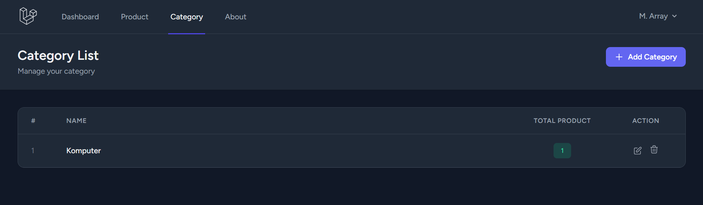
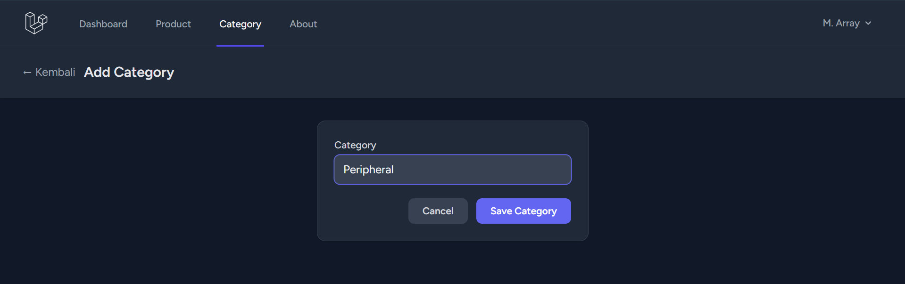
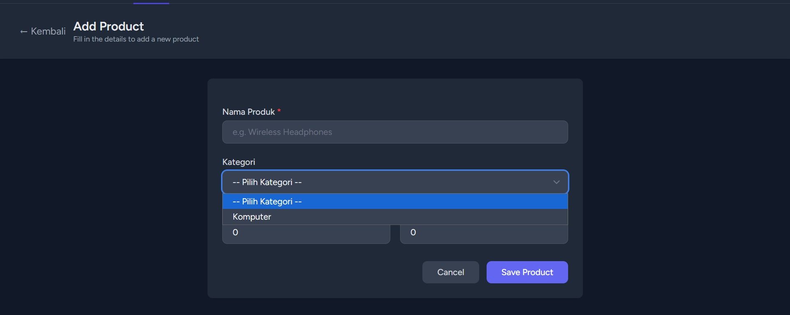
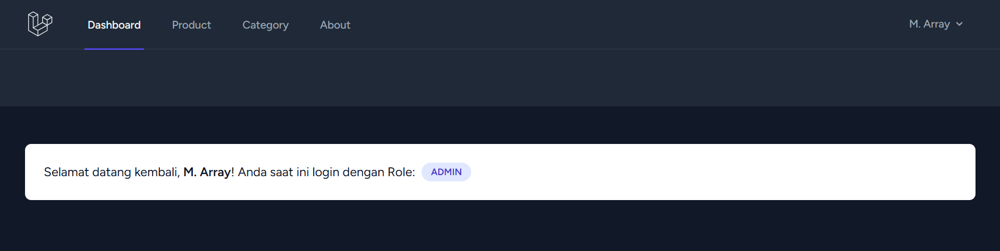
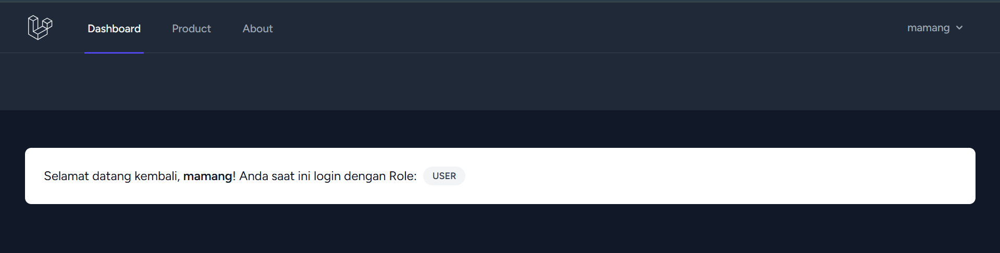

# Ujian Competency Praktek (UCP) 1 — CRUD Kategori, Relasi, dan RBAC

**Nama  :** Muhammad Array Al-khozini  
**NIM   :** 20230140208  
**Mata Kuliah :** Pemrograman Web Framework  

---

## 1. Fitur Kategori (Category)
Tabel `categories` dibuat dengan fitur hitung total produk (product count). Fitur ini dibuat khusus untuk role Admin.

### Halaman Daftar Kategori

### Form Tambah Kategori

---

## 2. Relasi Produk dan Kategori
Formulir untuk menambah dan mengubah produk (Product) diperbarui. Ditambahkan dropdown pilihan Kategori dari database, dan field pemilihan Pemilik (Owner) dihapus karena aplikasi sekarang otomatis menggunakan user ID dari pengguna yang sedang *login*.

### Form Tambah Produk (Dengan Kategori)

---

## 3. Otorisasi (Role-Based Access Control)
Hak akses disesuaikan sehingga hanya peran **Admin** yang dapat melihat menu Category. Peran **User** biasa hanya dapat melihat menu Dashboard, Product, dan About.

### Tampilan Navbar Login sebagai Admin

### Tampilan Navbar Login sebagai User Biasa

